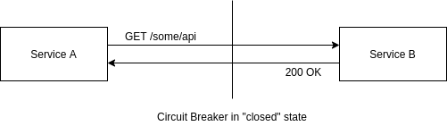
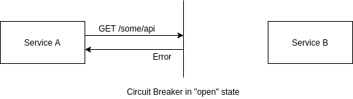

# Circuit Breakers

Circuit Breakers are a concept that I first read about in Michael Nygard's excellent book [Release It!](https://pragprog.com/titles/mnee2/release-it-second-edition/). They are useful when making RPC (e.g. an HTTP request) from one service to another, but can be used to wrap any operation that can fail. They are designed to isolate failures and prevent them from cascading.

As the name suggests, the concept comes from electrical circuit breakers in houses. The idea there being that, in order to prevent a fire from an electrical circuit overload, a breaker will open the circuit, cutting off power to some parts of the house. When the circuit is reset to a closed state, electricity can flow again.

A software circuit breaker works the same way. The circuit starts in the "closed" state, and requests can be made to another service.

As long as Service B is responding to RPCs successfully, the circuit breaker state will not change. When a certain amount of failures occur (this is usually a configurable threshold, say 10 failures out of 100) the circuit breaker "trips" and moves into the "open" state. In this state, requests are no longer attempted and the circuit breaker returns an error, rather than try to call a failing service. This is referred to as "failing fast".

Most circuit breaker implement a configurable timeout, or cool-down period, after which the circuit breaker will go from the "open" state to the "half-open" state. In this state, a small number of requests will be allowed to go through. If they are successful, the circuit breaker will go back to a "closed" state and traffic will start flowing to Service B again.

## Rationale

Circuit Breakers are a way to give a system a certain "self-healing" property. Many failure modes are intermittent and can be exasperated by calling services repeatedly attempting requests that are likely to fail. Implementing a circuit breaker allows the failing service an opportunity to recover (either automatically or with some manual intervention) without having to worry about all this incoming failing traffic. Once the service health is restored, traffic will start flowing again automatically.

## Implementations

There are a lot of implementations of circuit breakers. Two common libraries written in Java are Netflix's [Hystrix](https://github.com/Netflix/Hystrix) and the popular [resilience4j](https://github.com/resilience4j/resilience4j) library.