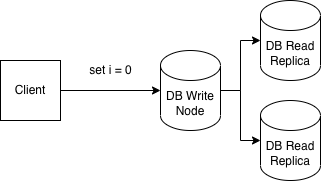
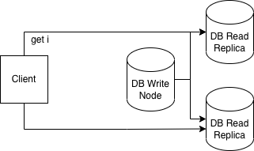

# Consistency

Consistency in a distributed system describes how different nodes agree or disagree on the state of the system. When performing atomic operations (operations that can only succeed or fail, there can be no partial failures), there is no question about the state of a system after each operation. For example, imagine that incrementing an integer is an atomic operation (whether it actually is or not is an implementation detail, but let's pretend for a second). After each step of the following pseudo code, we can read the value of the integer and be confident that the most recent increment will be reflected in the new value:

```
i = 0

print(i) // prints 0
i += 1
print(i) // prints 1
i += 1
print(i) // prints 2
```

This seems intuitive and obvious, but now imagine that setting a value of a variable requires coordination amongst nodes in a distributed system. For example, in a database system that does replication, you can have a single node that accepts all writes, and various nodes that can all answer reads. When a value is written to the write node, the change is broadcast to the other nodes. This is an overtly simplified example of what is called statement based replication.



Now, the write node will get the value as soon as the operation completes. The read nodes will then receive the new value when the statement is replicated to the read nodes. For arguments sake, let's say this is slow and not guaranteed to complete between operations. Now, when we go to increment the variable, a funny thing can happen. First we must read the value:



Because of how our system is configured, the read can go to any of the read replica nodes. Depending on whether this read hits the node before or after the first statement was replicated, we'll either receive an error because i is an unknown variable, or we'll receive the value 0.

In this example, the system cannot provide strong consistency guarantees - we are not guaranteed that a write will be immediately reflected in a subsequent read. In this case, this is happening because of some kind of replication lag.

## Necessary Trade-Offs

Systems can have various consistency models. Sometimes it's not strictly required that all writes are immediately reflected in subsequent reads. Consider a timeline in a social media application - someone can like a post, and if it's not reflected immediately when the author of the post loads their timeline, it's not a big deal. Search engines are another good example - it is not strictly important for a document to be immediately available for searching after being published, as long as it is eventually searchable.

In other systems, such as distributed key value stores used for things like leader election, you definitely want very strong consistency guarantees. In these cases, it is not acceptable that components of a system can see different versions of the systems state.

Balancing consistency trade-offs is a big topic in databases and distributed systems. In the future, this stub article may expand to include discussion or links to resources on consistency models and implications for the CAP theorem (TODO: link to article on CAP theorem when it's available).